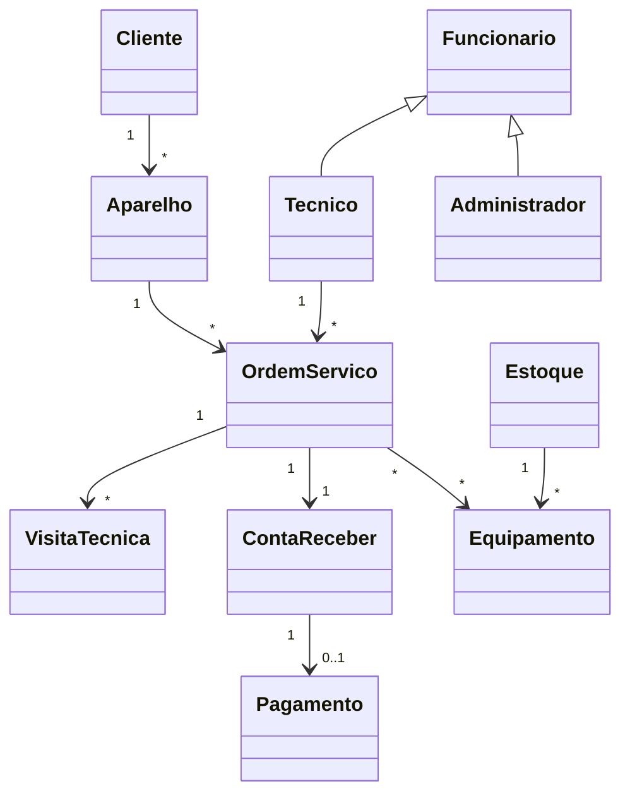

# Projeto – Sistema de Gestão de Assistência Técnica

## Disciplina

Programação Orientada a Objetos II

## Tema

Sistema de Gestão de Assistência Técnica

---

# 1. Objetivo

Desenvolver um sistema para gerenciar clientes, aparelhos, técnicos, estoque, pagamentos e ordens de serviço de uma assistência técnica, aplicando conceitos de Programação Orientada a Objetos, princípios SOLID e os padrões de projeto **Strategy** e **Factory Method**.

---

# 2. Objetivos Específicos

* Cadastrar clientes.
* Cadastrar aparelhos.
* Cadastrar funcionários.
* Gerenciar ordens de serviço.
* Registrar visitas técnicas.
* Controlar estoque de peças e equipamentos.
* Gerenciar pagamentos.
* Calcular automaticamente o valor das ordens de serviço.
* Aplicar padrões de projeto para aumentar a flexibilidade e a manutenção do sistema.

---

# 3. Tecnologias

* Python 3.12
* Flask
* SQLAlchemy
* PostgreSQL
* Pytest
* Pylint
* SonarQube
* Git
* GitHub

---

# 4. Conceitos de POO Aplicados

## Encapsulamento

Os atributos das classes serão protegidos e acessados através de métodos específicos.

## Herança

A classe Funcionario será a superclasse de:

* Tecnico
* Administrador

## Polimorfismo

As diferentes estratégias de cálculo utilizarão a mesma interface.

## Abstração

As entidades representam objetos do mundo real da assistência técnica.

---

# 5. Modelo de Negócio

## Cliente

Responsável por solicitar serviços de manutenção.

## Aparelho

Equipamento pertencente ao cliente.

## Ordem de Serviço

Registro do serviço executado.

## Técnico

Funcionário responsável pela execução dos reparos.

## Estoque

Controle das peças utilizadas.

## Conta a Receber

Controle financeiro das ordens de serviço.

---

# 6. Entidades do Sistema

## Cliente

* id
* nome
* cpf
* telefone
* email

## Aparelho

* id
* tipo
* marca
* modelo
* numero_serie
* observacoes

## Funcionario

* id
* nome
* cpf
* salario

## Tecnico

Herda de Funcionario.

## Administrador

Herda de Funcionario.

## OrdemServico

* id
* data_abertura
* data_encerramento
* descricao_problema
* status
* valor_total

## VisitaTecnica

* id
* data_agendamento
* data_realizacao
* resultado
* status

## Equipamento

* id
* nome
* quantidade
* valor_unitario

## Estoque

* id
* quantidade_disponivel
* quantidade_minima

## ContaReceber

* id
* valor
* vencimento
* status

## Pagamento

* id
* valor_pago
* data_pagamento
* forma_pagamento

---

# 7. Diagrama de Classes



---

# 8. Padrão Strategy

## Objetivo

Permitir diferentes formas de cálculo do valor final da Ordem de Serviço.

---

## Interface

```python
from abc import ABC, abstractmethod

class EstrategiaCalculo(ABC):

    @abstractmethod
    def calcular(self, valor_base):
        pass
```

---

## Estratégia Padrão

```python
class CalculoPadrao(EstrategiaCalculo):

    def calcular(self, valor_base):
        return valor_base
```

---

## Estratégia Urgente

```python
class CalculoUrgente(EstrategiaCalculo):

    def calcular(self, valor_base):
        return valor_base * 1.5
```

---

## Estratégia por Hora

```python
class CalculoPorHora(EstrategiaCalculo):

    def calcular(self, valor_base):
        return valor_base * 1.2
```

---

## Estratégia Domiciliar

```python
class CalculoDomiciliar(EstrategiaCalculo):

    def calcular(self, valor_base):
        return valor_base + 50
```

---

# 9. Padrão Factory Method

## Objetivo

Centralizar a criação das estratégias de cálculo.

---

## Classe Factory

```python
class EstrategiaFactory:

    @staticmethod
    def criar(tipo):

        if tipo == "urgente":
            return CalculoUrgente()

        if tipo == "hora":
            return CalculoPorHora()

        if tipo == "domiciliar":
            return CalculoDomiciliar()

        return CalculoPadrao()
```

---

# 10. Utilização dos Padrões

```python
tipo = "urgente"

estrategia = EstrategiaFactory.criar(tipo)

valor = estrategia.calcular(100)

print(valor)
```

Resultado:

```text
150.0
```

---

# 11. Benefícios Obtidos

## Strategy

* Permite trocar algoritmos de cálculo.
* Evita estruturas complexas de decisão.
* Facilita manutenção.

## Factory Method

* Centraliza a criação de objetos.
* Reduz acoplamento.
* Facilita inclusão de novas estratégias.

---

# 12. Princípios SOLID Aplicados

## SRP

Cada classe possui apenas uma responsabilidade.

## OCP

Novas estratégias podem ser criadas sem alterar as existentes.

## LSP

Todas as estratégias podem substituir a interface base.

## ISP

Interfaces pequenas e específicas.

## DIP

A Ordem de Serviço depende da abstração EstrategiaCalculo.

---

# 13. Testes Unitários

Utilização do Pytest para validar:

* Cadastro de clientes.
* Cadastro de aparelhos.
* Criação de ordens de serviço.
* Estratégias de cálculo.
* Factory Method.
* Controle de estoque.
* Pagamentos.

---

# 14. Conclusão

O projeto utiliza conceitos fundamentais de Programação Orientada a Objetos, aplicando herança, polimorfismo, encapsulamento e abstração. Além disso, emprega os padrões de projeto Strategy e Factory Method para tornar o sistema flexível, extensível e aderente aos princípios SOLID, resultando em uma solução organizada e de fácil manutenção.
